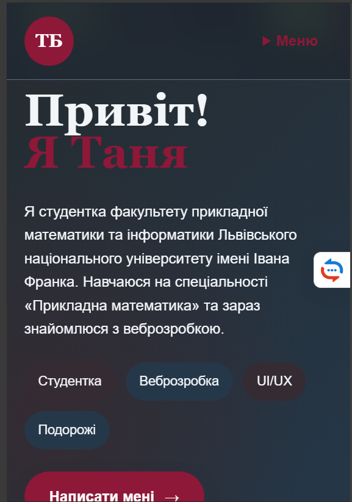
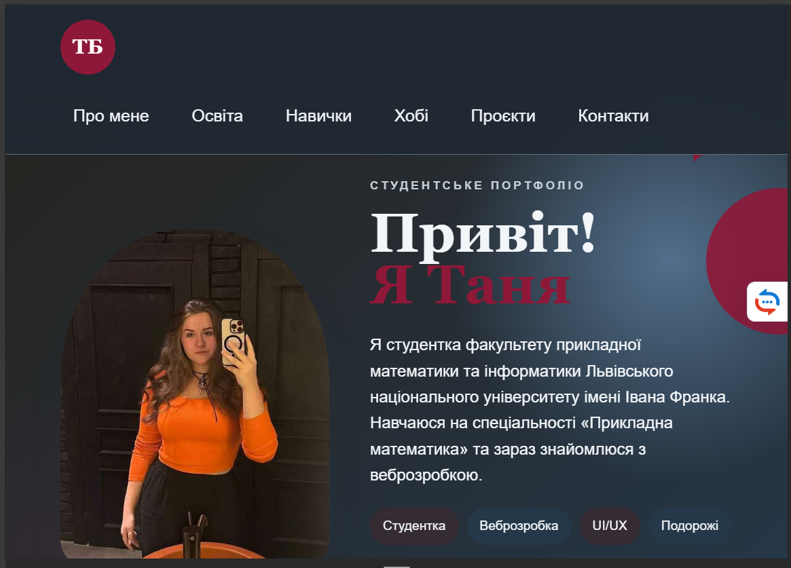
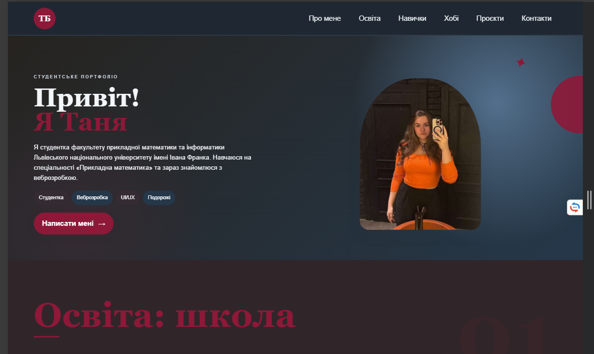
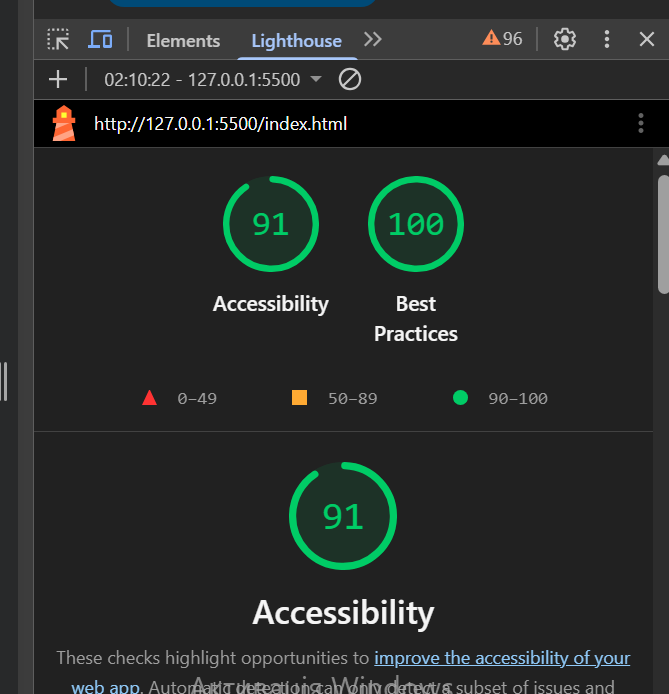
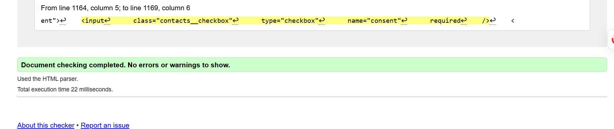

# Персональне портфоліо

Односторінковий адаптивний сайт-портфоліо, створений у межах навчального завдання з вебпрограмування.

Сайт містить інформацію про мене, моє навчання, навички, хобі, улюблені книги та фільми, спорт, подорожі, проєкти, цілі, цікаві факти та контактну інформацію.

Проєкт реалізований без JavaScript та без використання CSS- або UI-фреймворків.

## Жива версія

Сайт опублікований за допомогою GitHub Pages:

**[Переглянути сайт](ПОСИЛАННЯ_НА_GITHUB_PAGES)**

## Використані технології

- HTML5
- CSS3
- Flexbox
- CSS Grid
- CSS Custom Properties
- Media Queries
- Git
- GitHub
- GitHub Pages

## Структура проєкту

```text
First-homework/
├── index.html
├── css/
│   └── style.css
├── img/
└── README.md
```

## Основні розділи

Сайт містить понад 15 змістовних секцій:

1. Про мене
2. Школа
3. Університет
4. Улюблені предмети
5. Навички
6. Хобі
7. Книги
8. Музика
9. Фільми
10. Спорт
11. Подорожі
12. Мій улюбленець
13. Проєкти та досягнення
14. Цілі
15. Цікаві факти
16. Улюблені цитати
17. Контакти

Також сайт містить навігацію та footer із посиланнями на соціальні мережі.

## Адаптивність

Сайт створений за принципом Mobile First та адаптується до різних розмірів екрана.

### Mobile — до 767px

- вертикальне розташування основного контенту;
- навігація реалізована у вигляді меню через `<details>` та `<summary>` без JavaScript;
- фотографія в секції «Про мене» розташована над текстом;
- картки розташовуються переважно в одну колонку;
- галерея хобі має одноколонкове відображення;
- використані компактніші відступи та розміри тексту.

### Tablet — від 768px до 1199px

- навігаційні посилання відображаються горизонтально;
- у секції «Про мене» фотографія розташовується ліворуч, а текст — праворуч за допомогою Flexbox;
- картки можуть розташовуватися у дві колонки;
- галерея переходить у двоколонкову сітку;
- збільшуються відступи між елементами.

### Desktop — від 1200px

- логотип і навігація розташовані в одному горизонтальному рядку;
- використовується розширений двоколонковий макет секції «Про мене»;
- для складніших макетів використовується CSS Grid;
- картки розташовуються у три або більше колонок залежно від секції;
- галерея хобі перетворюється на мозаїчну сітку з елементами різного розміру;
- збільшуються відступи та розмір базової типографіки.

Також використовується додатковий breakpoint `1600px` для оптимізації відображення на великих екранах.

## Три макети

### Mobile



### Tablet



### Desktop



## Семантика HTML

У проєкті використані семантичні HTML5-елементи, зокрема:

- `<header>`
- `<nav>`
- `<main>`
- `<section>`
- `<article>`
- `<aside>`
- `<figure>`
- `<figcaption>`
- `<blockquote>`
- `<address>`
- `<footer>`
- `<picture>`
- `<details>`
- `<summary>`
- `<time>`

На сторінці використовується один головний заголовок `<h1>` та логічна ієрархія наступних заголовків.

Для таблиці використані `<caption>`, `<thead>`, `<tbody>` та атрибут `scope`.

Форма містить пов'язані `label`, обов'язкові поля та HTML-валідацію.

## Доступність

Під час розробки було приділено увагу доступності сайту.

Реалізовано:

- skip link «Перейти до основного вмісту»;
- повну клавіатурну навігацію;
- видимий стан `:focus-visible`;
- `aria-label` для елементів, призначення яких може бути неочевидним;
- змістовні `alt` для зображень;
- семантичну HTML-структуру;
- підтримку `prefers-reduced-motion`;
- достатній контраст тексту та фону.

### Перевірка контрасту

Контраст перевірявся за допомогою WebAIM Contrast Checker.

| Текст | Фон | Контраст | Результат |
|---|---|---:|---|
| `#687486` | `#FFFFFF` | 4.73:1 | PASS |
| `#8E1838` | `#F7E6E8` | 7.45:1 | PASS |
| `#F3F6F9` | `#202832` | 13.72:1 | PASS |


Для звичайного тексту використовувалося мінімальне співвідношення контрасту `4.5:1`.

## Lighthouse

Перевірка проводилася в Chrome DevTools у режимі **Mobile**.

Результати:

- **Accessibility — 91**
- **Best Practices — 100**

Обидва показники відповідають вимозі не менше 90 балів.



## W3C Validation

HTML-код було перевірено за допомогою W3C Markup Validation Service.

Після виправлення помилок розмітка проходить перевірку без помилок.



## Оптимізація зображень

Для зменшення ваги сторінки растрові зображення були оптимізовані та зменшені до розмірів, достатніх для відображення на вебсторінці.

Сумарний розмір зображень після оптимізації становить приблизно **1,44 МБ**, що відповідає вимозі до 3 МБ.

Для адаптивного відображення головного фото використовується елемент `<picture>` із різними джерелами зображення залежно від ширини екрана.

## CSS

У стилізації використані:

- CSS-змінні;
- `clamp()` для адаптивних розмірів;
- відносні одиниці вимірювання;
- Flexbox;
- CSS Grid;
- media queries;
- псевдокласи;
- псевдоелементи;
- transitions;
- keyframe-анімації;
- `prefers-reduced-motion`;
- `prefers-color-scheme` для темної теми.

Класи компонентів організовані за принципами BEM.

## Темна тема

Сайт підтримує автоматичну темну тему за допомогою:

```css
@media (prefers-color-scheme: dark)
```

Кольори темної теми реалізовані переважно через перевизначення CSS-змінних.

## Використання ШІ

Під час виконання роботи використовувався **ChatGPT (OpenAI)** як допоміжний інструмент та довідник.

ШІ використовувався для:

- консультацій щодо семантичної HTML-структури;
- перевірки та рев'ю HTML і CSS;
- консультацій щодо адаптивної верстки;
- роботи з Flexbox та CSS Grid;
- перевірки відповідності вимогам Mobile First;
- рекомендацій щодо доступності та `focus-visible`;
- допомоги з нативною HTML-валідацією контактної форми;
- пошуку та виправлення помилок у розмітці;
- рекомендацій щодо оптимізації зображень;
- створення допоміжного Python-скрипту для локального стиснення зображень.

У фінальній версії проєкту залишені окремі запропоновані ШІ фрагменти HTML/CSS, зокрема рішення для адаптивної верстки, станів фокусу, медіа-запитів та доступності. Також для локальної оптимізації зображень використовувався запропонований ШІ Python-скрипт.

Усі використані фрагменти були перевірені, адаптовані до структури цього проєкту та інтегровані у власну реалізацію. JavaScript і сторонні CSS/UI-фреймворки в проєкті не використовуються.

## Автор

**Тетяна Брик**

Студентське портфоліо, створене в межах навчального завдання з вебпрограмування.